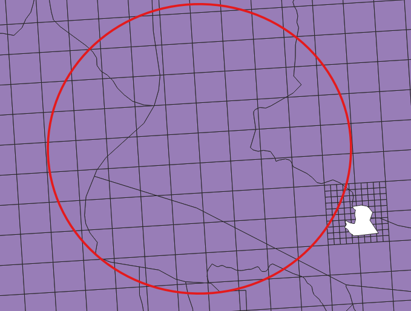
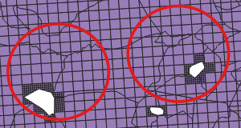
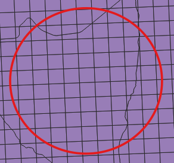
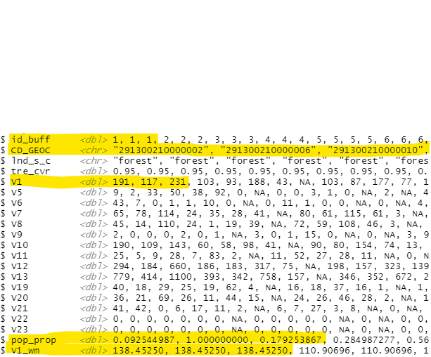
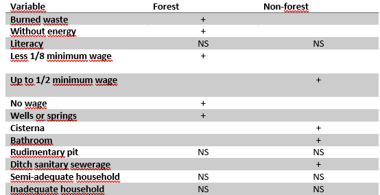

```{r, include=FALSE} 
#library
library(raster)
library(geobr)
library(dplyr)
library(here)
library(sf)
library(ggplot2)
load(here(".RData"))
```

class: inverse
#data

- [World Pop](https://www.worldpop.org/): Constrained data
  - People per pixel
  - ~3arc seconds (aprox. 100m at equator)
  - data from 2020
- [LandScan](https://landscan.ornl.gov/)
  - People per pixel
  - 1km at equator
  - data from 2010, 2015, 2019
- [IBGE Grade Estatística](https://geoftp.ibge.gov.br/recortes_para_fins_estatisticos/grade_estatistica/censo_2010/grade_estatistica.pdf)
  - People per "pixel"
  - 1km x 1km
  - data from 2010 census
--

- [Forested Plots](https://www.science.org/doi/10.1126/science.aam6527)
  - Each plot classified as forest (>20% of tree cover) and non-forest
  - 6,200 plots in Caatinga, but 1,606 forested

--
- Censo demográfico 2010
  - Setor censitário
  - Only rural sector

---
class: inverse
#Data processing
##Estimates of Forest proximate people
.center[
```{r echo=F, out.width="50%", message=FALSE, warning=FALSE}
ggplot() +
  geom_raster(data = pop_caat_tibble, aes(x=x, y=y, fill=pop_caat_polybr_1000))+
  geom_sf(data = caat_shp_polybr, fill= NA, colour = "black", size = .3) +
  geom_sf(data = plot_caat_polybr, size =0.1) +
  geom_sf(data=st_as_sf(buff_1km_union), fill = NA, col = "red") +
  geom_sf(data=st_as_sf(buff_5km_union), fill = NA, col = "red") +
  geom_sf(data=st_as_sf(buff_10km_union), fill = NA, col = "red") +
  coord_cartesian(xlim = c(6500000,7000000), ylim = c(9000000,9500000))+
  coord_sf(xlim = c(6800000,7000000), ylim = c(9000000,9200000))+
  scale_fill_viridis_c(name = "Population in Caatinga") +
  theme(panel.background = element_blank(),
        axis.title = element_blank()
  )
```
]
---
# Population closed to forest by different datasets
```{r echo=FALSE}
kableExtra::kable(df_pop_all)

```

---
class: inverse
#Data processing
###Estimative of socieconomic condition of forest proxiamte people

- Forest buffers with more than one sector
 <br/>

- ... and same sectors within multiple buffers
<br/>

- Weighted sector variables by the % of people inside buffers 

.pull-left[
```{r echo=FALSE, out.width= "80%"}
 
```
]

.pull-right[
```{r echo=FALSE , out.width= "100%"}
 
```
]

---
#Data processing
###Estimative of socieconomic condition of forest proxiamte people
- Weighted means

.pull-left[
```{r echo=FALSE, out.width= "85%"}
 
```
]

--

.pull-right[
```{r echo=FALSE, out.width= "95%"}
 
```
]

---
#Results
###Compare people's conditions
- Data for analysis is in percentage (of household or people)

- simple GLMs comparing socioeconomic conditions in buffers with and without forests

---
#Results
###Compare people's conditions
```{r echo=FALSE, out.width= "80%", fig.align='center'}
 
```
---
#Next steps
###Compare income between buffers with and without forests
- Use matching to find pairs
